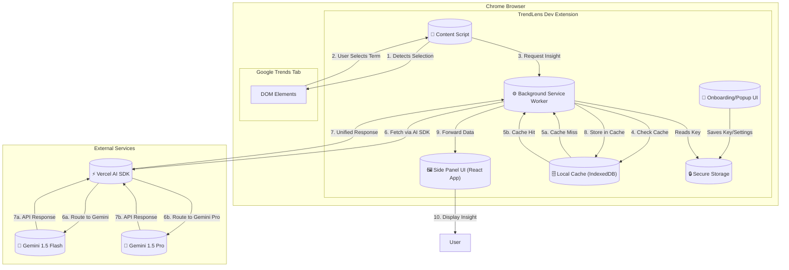

### **TrendLens Dev - 技术架构文档 (v1.0)**

#### **1. 高阶架构图 (C4 - Component Diagram)**

我将使用 Mermaid 图表来展示核心组件及其交互关系。

#### **2.核心组件拆解**

* **Content Script (`content-script.js`)**:
    * **职责**: 唯一与 Google Trends 页面 DOM 直接交互的脚本。
    * **功能**: 侦测并注入勾选框到 Trends 列表；监听用户的勾选事件；通知 Background Service Worker 用户选择了哪个关键词。

* **Background Service Worker (`background.js`)**:
    * **职责**: 扩展的大脑，处理核心逻辑，但不直接操作 UI。
    * **功能**:
        1.  接收 Content Script 的消息。
        2.  管理与 Gemini API 的通信（创建请求、处理响应/错误）。将通过 **Vercel AI SDK** 进行封装，以简化API调用和错误处理。
        3.  实现缓存逻辑：在请求 API 前先检查 `Local Cache`，获取到数据后存入缓存。
        4.  作为 Content Script 和 Side Panel 之间的消息代理。
        5.  从 `Secure Storage` 中读取用户的 API Key。

* **Side Panel UI (`side-panel.html/.tsx`)**:
    * **职责**: 主交互界面，用于展示所有洞察信息。
    * **技术**: 使用 React 和 TypeScript 构建的单页应用 (SPA)。
    * **功能**: 接收 Background Service Worker 推送的数据并渲染；展示 Tab 视图（定义/文化背景）、Loading Skeleton、错误信息；处理用户操作（复制 Markdown、导出 CSV）。

* **Onboarding/Popup UI (`popup.html/.tsx`)**:
    * **职责**: 用户首次配置和快速访问的入口。
    * **功能**: 引导用户输入并**验证** Gemini API Key；选择结果语言；将配置安全地存入 `Secure Storage`。

* **Constants Layer (`src/constants/`)**:
    * **职责**: 集中管理应用级常量和配置。
    * **功能**: 
        - `languages.ts` - 统一的语言配置，包括核心语言和扩展语言
        - 提供语言相关的工具函数（`getLanguageNativeName`, `getLanguageLabel`等）
        - 确保语言配置的一致性，避免重复定义

* **Local Cache (`cache.ts`)**:
    * **职责**: 实现高性能响应的关键模块。
    * **技术**: 基于 `IndexedDB` 封装。提供简单的 `get(key)` 和 `set(key, value)` 接口。
    * **逻辑**: 缓存 API 返回的分析结果，以关键词作为 Key。

* **Secure Storage (`storage.ts`)**:
    * **职责**: 安全存储用户的敏感信息。
    * **技术**: 使用 `chrome.storage.local` API。这是 Chrome 扩展推荐的安全存储方式，与 `localStorage` 不同，它更安全且异步。

#### **3. 技术选型 (Tech Stack)**

| 类别 | 技术/库 | 理由 |
| :--- | :--- | :--- |
| **核心框架** | React + TypeScript | 强大的生态，组件化开发模式，类型安全。 |
| **UI 样式** | TailwindCSS | PRD 中已提及，能够快速构建 UI 并支持 a11y。 |
| **构建工具**| Vite | 极速的开发服务器和构建体验。 |
| **API 通信**| `fetch` API | 浏览器原生，无需额外依赖。 |
| **扩展标准**| Manifest V3 | 最新的 Chrome 扩展标准，安全性更高。 |

#### **4. 架构决策记录 (ADR)**

所有重要的架构决策都将被记录在 ADR 中，以供追溯和理解技术选型背后的原因。

*   **[ADR-001: Tavily API 集成](./architecture/ADR-001-tavily-api-integration.md)** - 关于为何以及如何选择并集成 Tavily API 用于搜索和数据提取的决策。

---

#### **5. 历史文档**

*   **[项目重构计划](./archive/project-restructure-plan.md)**: 本文档记录了项目从 Next.js 迁移到基于 Vite 的 Chrome Extension 架构的初始规划。它为当前的项目结构提供了重要的历史背景。