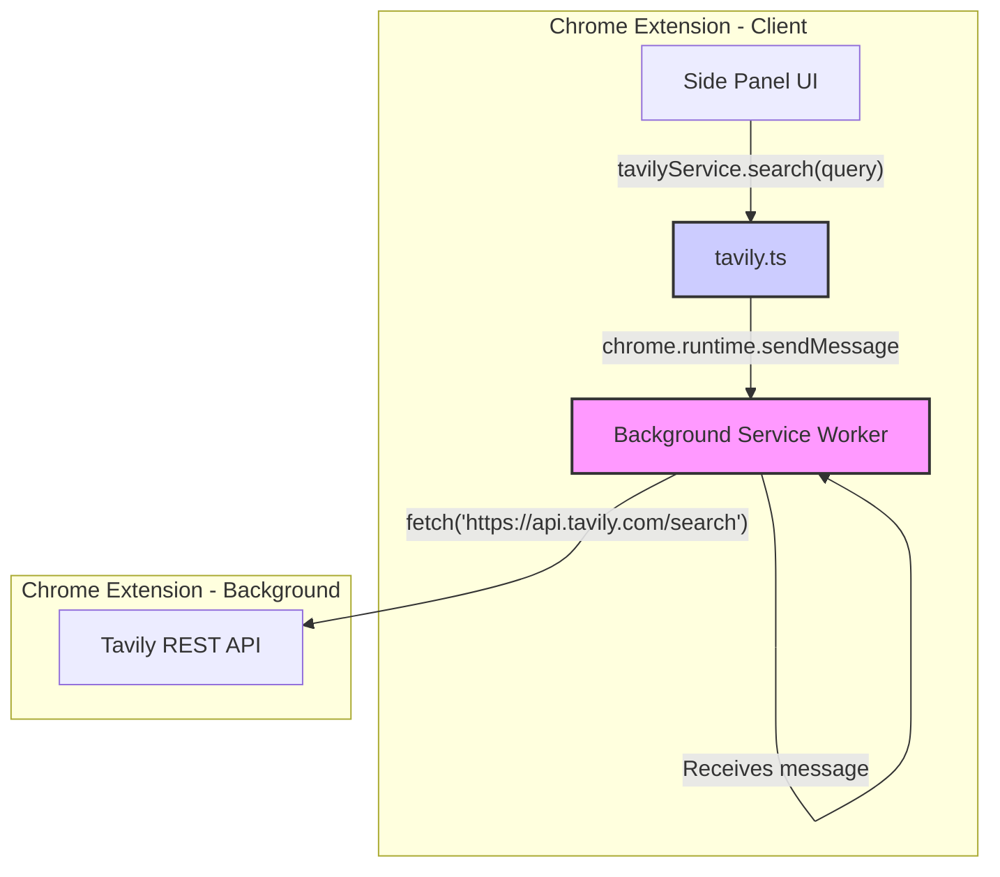

# ADR-001: 转向使用 Tavily REST API 替代其 SDK

**状态**: 已接受

**日期**: 2024-08-01

## 1. 背景 (Context)

在我们的 Chrome 扩展中集成了 Tavily 搜索功能，以增强 AI 分析能力。最初的实现方案是直接在客户端代码中使用了官方的 `@tavily/core` JavaScript SDK。这导致了三个严重问题：

1.  **运行时错误**: 扩展报出 `Uncaught TypeError: Class extends value undefined is not a constructor or null`。
2.  **打包体积剧增**: 客户端产物体积从 <2MB 膨胀到 >7MB。
3.  **安全风险**: 在客户端处理 API Key 存在暴露风险。

根本原因是 `@tavily/core` SDK 主要为 Node.js 环境设计，不兼容浏览器。

## 2. 决策 (Decision)

我们决定 **弃用 `@tavily/core` SDK**，并重构为 **通过后台 Service Worker 直接调用 Tavily 的 REST API 端点** (`https://api.tavily.com/search`)。

## 3. 理由 (Consequences)

1.  **解决打包问题**: 避免了将不兼容的 Node.js 依赖打包到客户端。
2.  **提升安全性**: API Key 的存储和使用仅限于 Service Worker，不会暴露给前端。
3.  **架构解耦**: 明确了前端（UI）和后端（Service Worker）的职责，结构更清晰。
4.  **稳定可控**: 直接使用 REST API，对网络请求有完全的控制权。

## 4. 实现方案 (Implementation Details)

### 4.1 架构图



### 4.2 前端消息客户端 (`src/services/tavily.ts`)

该文件负责将搜索请求从前端组件发送到 Service Worker。

```typescript
// src/services/tavily.ts
export interface TavilySearchRequest {
  type: 'TAVILY_SEARCH';
  payload: { query: string; searchDepth?: 'basic' | 'advanced'; maxResults?: number; };
}

class TavilyApiService {
  async search(query: string, searchDepth: 'basic' | 'advanced' = 'advanced', maxResults: number = 7) {
    const request: TavilySearchRequest = {
      type: 'TAVILY_SEARCH',
      payload: { query, searchDepth, maxResults },
    };
    const response = await chrome.runtime.sendMessage(request);
    if (response?.error) throw new Error(response.error.message);
    return response?.data;
  }
}
export const tavilyService = new TavilyApiService();
```

### 4.3 后台 API 代理 (`src/background.ts`)

Service Worker 监听消息，安全地获取 API Key，并执行对 Tavily REST API 的调用。

```typescript
// src/background.ts
chrome.runtime.onMessage.addListener((request, sender, sendResponse) => {
  if (request.type === 'TAVILY_SEARCH') {
    const handleSearch = async () => {
      try {
        const apiKey = await storageService.getTavilyApiKey();
        if (!apiKey) return { error: { message: 'Tavily API key not found.' } };

        const response = await fetch('https://api.tavily.com/search', {
          method: 'POST',
          headers: { 'Content-Type': 'application/json', 'Authorization': `Bearer ${apiKey}` },
          body: JSON.stringify(request.payload), 
        });

        if (!response.ok) {
          const errorData = await response.json();
          return { error: { message: `Tavily API Error: ${errorData.detail}` } };
        }
        return { data: await response.json() };
      } catch (error) {
        return { error: { message: error instanceof Error ? error.message : 'Unknown error' } };
      }
    };

    handleSearch().then(sendResponse);
    return true; // Keep message channel open for async response
  }
});
```

## 5. 后续影响

- 已从项目中移除 `@tavily/core` 依赖。
- 文档 `docs/tavily-integration-arch.md` 将被删除，以此 ADR 为准。 